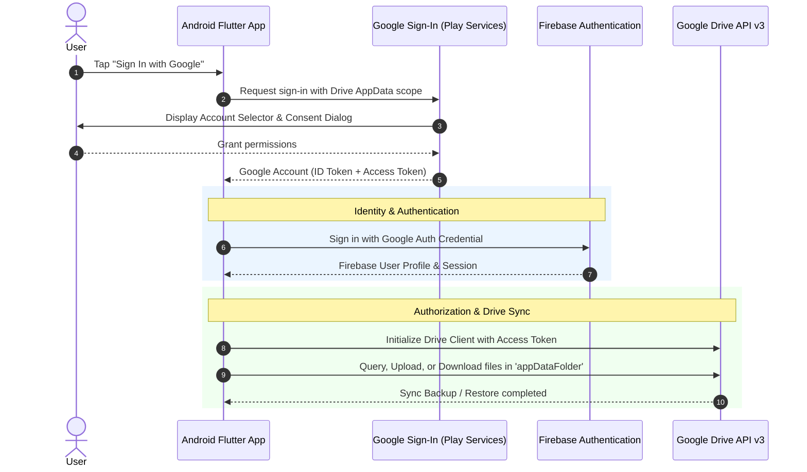

# Firebase Google Sign-In & Google Drive Sync Requirements & Setup Guide

This document outlines the architecture, end-to-end setup requirements, and detailed pricing breakdown for integrating **Firebase Authentication (Google Sign-In)** and **Google Drive Synchronization** into an Android Flutter application.

---

## 1. Pricing, Costs & Quota Limits

A major advantage of this architecture is that **it can operate completely free of cost** for both development and production scale.

| Service / Resource                           | Pricing Tier          | Cost                      | Quota / Limits                                                                                                                                                       |
| :------------------------------------------- | :-------------------- | :------------------------ | :------------------------------------------------------------------------------------------------------------------------------------------------------------------- |
| **Firebase Authentication** (Google Sign-In) | Spark Plan (Free)     | **$0.00 / month**         | Unlimited Google Sign-In users under standard Firebase Auth (or up to 50,000 Monthly Active Users if upgraded to Google Cloud Identity Platform).                    |
| **Google Drive API v3**                      | Google Cloud APIs     | **$0.00**                 | Free API access. Default quota allows up to **12,000 requests per minute per project** and **20,000 requests per 100 seconds per user**.                             |
| **Cloud Storage for User Backups**           | User's Personal Drive | **$0.00 to Developer**    | Data is stored directly in the end-user's personal Google Drive account (using their free 15 GB quota). The developer pays **$0** for storage bandwidth and hosting. |
| **Google Cloud Project**                     | Standard GCP Project  | **$0.00**                 | Creating projects, configuring OAuth consent screens, and generating OAuth credentials does not require billing or a credit card.                                    |
| **Google Play Developer Account**            | Google Play Console   | **$25.00 (One-time fee)** | Optional: Only required if publishing the app to the Google Play Store.                                                                                              |

### Cost Summary & Key Highlights
* **Zero Server Infrastructure**: No custom backend servers, relational databases, or cloud buckets (like S3 or Firebase Storage) need to be provisioned or billed to your account.
* **Storage Cost Offloaded**: App backup data resides in each user's private Google Drive quota, meaning your storage costs do not increase as your user base grows.
* **Firebase Spark Plan**: The free Spark plan is 100% sufficient for this setup. No credit card is required to set up or run this service.

---

## 2. Comprehensive Requirements

### 2.1. Developer & Account Requirements
* **Google Account**: An active Google account with administrative access to Google Cloud Console and Firebase Console.
* **Firebase Project**: A registered Firebase project (e.g., on the free Spark plan).
* **Google Cloud Console Access**: Associated with the same project ID as the Firebase project.
* **Development Environment**: 
  * Android SDK with command-line tools.
  * Java Development Kit (JDK 17 or higher) to run the `keytool` utility.
  * Flutter SDK installed.

### 2.2. Platform & Device Requirements (End-User)
* **Operating System**: Android 6.0 (API Level 23) or higher.
* **Google Play Services**: The device or emulator must have an updated version of Google Play Services installed. (Emulators without Google APIs / Play Store images cannot complete Google Sign-In).
* **Google Account on Device**: At least one active Google account configured on the Android device.
* **Internet Connection**: Required for authentication token exchange and Google Drive synchronization.

### 2.3. Google Cloud Platform Requirements
* **Google Drive API v3**: Must be explicitly toggled to **Enabled** in the Google Cloud Console API Library.
* **OAuth Consent Screen**:
  * **User Type**: Set to **External** (for general public or test accounts).
  * **Support Email & Developer Contact**: Required fields; omitting them causes authentication errors.
  * **OAuth Scopes**: Must include:
    * `.../auth/userinfo.email`
    * `.../auth/userinfo.profile`
    * `openid`
    * `https://www.googleapis.com/auth/drive.appdata` (Hidden AppData folder) OR `https://www.googleapis.com/auth/drive.file` (Per-file access).
  * **Test Users**: While the OAuth consent screen status is "Testing", all Google accounts used for testing must be manually added to the Test Users list.

### 2.4. Keystore & Security Fingerprint Requirements
* **Debug Keystore SHA-1 & SHA-256**:
  * Extracted from the local machine's debug keystore.
  * Required by Google Play Services to authorize the Android client request.
  * Note: Each developer machine has its own distinct debug keystore; every team member's SHA-1 must be registered.
* **Release Keystore SHA-1 & SHA-256**:
  * Extracted from the production signing key.
  * If using Google Play App Signing, the SHA-1 from the **Google Play Console (App Integrity)** must also be added to Firebase.

### 2.5. Native Android Project Requirements
* **Application / Package ID**: Unique reverse-domain identifier (e.g., `in.logapp.test`).
* **Firebase Configuration File**: `google-services.json` placed directly inside the `android/app/` folder.
* **Android Permissions**:
  * `android.permission.INTERNET`
  * `android.permission.ACCESS_NETWORK_STATE`
* **Gradle Plugins**:
  * Google Services Gradle plugin (`com.google.gms.google-services`) applied to the project.
* **Minimum SDK Version**: `minSdk = 23`.

### 2.6. Flutter Package Requirements
The project must include the following packages:
* **`firebase_core`**: Initializes the Firebase SDK on startup.
* **`firebase_auth`**: Manages the user authentication state and session.
* **`google_sign_in`**: Manages the native Android Google Sign-In flow, account picker, and OAuth scope consent.
* **`googleapis`**: Official Google client library providing direct access to Google Drive API v3.
* **`extension_google_sign_in_as_googleapis_auth`**: Bridges `google_sign_in` with `googleapis` by providing an authenticated HTTP client carrying bearer tokens.
* **`path_provider`**: Resolves local device directories for caching backup files before upload or after download.

---

## 3. Architecture & Scopes Overview

### Authentication vs. Authorization



### Storage Location: `appDataFolder` vs. Root Drive
* **`https://www.googleapis.com/auth/drive.appdata` (Recommended)**:
  * Files are stored in a hidden application data directory specific to this app.
  * Files do not appear in the user's main Google Drive file list, preventing accidental deletion or renaming by the user.
  * Other third-party apps cannot access or inspect these files.
* **`https://www.googleapis.com/auth/drive.file`**:
  * Files are created in the user's visible Google Drive root or a selected subfolder.
  * User can see and download the backup files directly via web browser.

---

## 4. Step-by-Step Setup Workflow

### Step 1: Extract Keystore SHA Fingerprints
1. Use the `keytool` command-line utility bundled with the JDK to inspect your debug keystore (`debug.keystore`).
2. Extract the **SHA1** and **SHA256** certificate fingerprints.

### Step 2: Configure Firebase Console
1. Open the Firebase Console and select or create your project.
2. Add an **Android Application**:
   * Enter the exact Package Name (`in.logapp.test`).
   * Enter an App Nickname.
   * Paste the **SHA-1** fingerprint obtained in Step 1.
3. Download the generated `google-services.json` file.
4. Move `google-services.json` into the `android/app/` directory of your Flutter project.
5. In Firebase Console, go to **Build > Authentication > Sign-in method**:
   * Enable the **Google** provider.
   * Select your support email.
   * Save the configuration.

### Step 3: Configure Google Cloud Console
1. Navigate to Google Cloud Console with the same project selected.
2. In **APIs & Services > Library**, search for **Google Drive API** and enable it.
3. In **APIs & Services > OAuth consent screen**:
   * Choose **External**.
   * Fill out the App Name, User Support Email, and Developer Email.
   * Add scopes: `email`, `profile`, `openid`, and `https://www.googleapis.com/auth/drive.appdata`.
   * Add your test Gmail addresses to the **Test Users** list.
   * Save and finish.

### Step 4: Configure Android Native Project Settings
1. In `android/settings.gradle.kts`, register the `com.google.gms.google-services` plugin.
2. In `android/app/build.gradle.kts`:
   * Apply the `com.google.gms.google-services` plugin.
   * Set `namespace` and `applicationId` to `in.logapp.test`.
   * Ensure `minSdk` is set to `23`.
3. In `android/app/src/main/AndroidManifest.xml`:
   * Add `<uses-permission android:name="android.permission.INTERNET"/>`.
   * Add `<uses-permission android:name="android.permission.ACCESS_NETWORK_STATE"/>`.

---

## 5. Synchronization & Data Flow Logic

### Backup Process (Upload)
1. User taps "Backup to Google Drive" or a background trigger runs.
2. The app verifies that the user is signed in with a valid Google Account.
3. An authenticated HTTP client is generated using the user's OAuth access token.
4. The app queries the Drive `appDataFolder` for an existing file with the target backup name.
5. **If existing file found**: The app updates the content of the existing file (preventing duplicate copies).
6. **If no file found**: The app creates a new file inside the `appDataFolder` parent folder.
7. The last backup timestamp is recorded locally.

### Restore Process (Download)
1. User taps "Restore from Google Drive".
2. The app queries the `appDataFolder` space for available backup files.
3. If no file exists, the user is notified that no previous cloud backup is present.
4. If a file exists, the app streams the file contents into memory or a temporary local cache.
5. The local application database or preferences are updated with the restored data.

---

## 6. Common Troubleshooting & Error Resolution

| Error / Symptom | Root Cause | Solution |
| :--- | :--- | :--- |
| **`ApiException: 10`** | Missing SHA-1 / SHA-256 fingerprint in Firebase, Google sign-in provider disabled, or `"oauth_client": []` is empty in `google-services.json`. | 1) Enable Google under Authentication > Sign-in method.<br>2) Add debug SHA-1 & SHA-256 under Project settings > Your apps.<br>3) Re-download `google-services.json` ensuring `oauth_client` has entries. |
| **`ApiException: 12500`** | OAuth Consent screen is incomplete or missing a user support email. | Open Google Cloud Console > OAuth consent screen, ensure the support email is set, and save. |
| **`Access Not Configured` / `403 Forbidden`** | Google Drive API is disabled in the Google Cloud Project. | Enable Google Drive API in Google Cloud Console > APIs & Services > Library. |
| **Drive 401 Unauthorized** | The `drive.appdata` scope was not requested or approved during sign-in. | Ensure the Drive scope is included in the sign-in request and that the user granted the Drive permission during consent. |
| **Sign-in immediately cancels / No accounts shown** | Running on an emulator without Google Play Services or bad system image. | Use an Android device or an emulator image that explicitly includes Google Play Store support. |
| **Sign-in blocked ("Access blocked: App has not completed the Google verification process")** | OAuth Consent screen is in "Testing" mode and the user is not listed. | Add the user's Gmail address to the "Test users" list under OAuth consent screen in Google Cloud Console. |

---

## 7. Setup Verification Checklist

- [ ] Firebase project established on Spark Plan (No cost)
- [ ] Google Drive API v3 enabled in Google Cloud Console
- [ ] OAuth Consent Screen configured with support email and `drive.appdata` scope
- [ ] Test Gmail accounts added to Test Users list
- [ ] Debug keystore SHA-1 and SHA-256 added to Firebase Android App settings
- [ ] `google-services.json` placed in `android/app/`
- [ ] Google Sign-In provider enabled in Firebase Authentication
- [ ] Android application package set to `in.logapp.test` with `minSdk = 23`
- [ ] Internet permissions declared in `AndroidManifest.xml`
- [ ] Device/emulator verified with Google Play Services and logged-in Google account

---

## 8. Step-by-Step Execution Guide & Testing Workflow

### Step 1: Install Dependencies
Run `flutter pub get` inside the `test_app` directory to resolve the newly added packages:
```powershell
cd c:\Users\hipradeep\Documents\android_apps\log_app\test_app
flutter pub get
```

### Step 2: Get Your Debug SHA-1 & SHA-256 Fingerprints
Google Sign-In strictly requires your machine's debug SHA-1. Run this command in your terminal:
```powershell
keytool -list -v -keystore "$env:USERPROFILE\.android\debug.keystore" -alias androiddebugkey -storepass android -keypass android
```
Copy the **SHA1** and **SHA256** values from the output.

### Step 3: Configure Firebase Console (Google Provider & SHA-1)
> [!IMPORTANT]
> Both steps below are required for Firebase to populate `"oauth_client"` in `google-services.json`. If skipped, Google Sign-In will fail with `ApiException: 10`.

1. **Enable Google Sign-In Provider**:
   * Open [Firebase Console](https://console.firebase.google.com/) and select your project (`test-app-dfa9e`).
   * Navigate to **Build** (or **Security**) > **Authentication** (or direct URL: `https://console.firebase.google.com/project/YOUR_PROJECT_ID/authentication`).
   * Click the **Sign-in method** tab.
   * Click **Google** under *Additional providers*.
   * Toggle the switch to **Enable**, choose your email in the **Project support email** dropdown, and click **Save**.
   * *(This creates the OAuth 2.0 Web Client ID, `client_type: 3`)*.

2. **Register SHA-1 & SHA-256 Fingerprints**:
   * Go to ⚙️ **Project Settings** (gear icon next to Project Overview) > **General** tab.
   * Scroll down to the **Your apps** section and select your Android app (`in.logapp.test`).
   * Click **Add fingerprint** and paste the **SHA-1** from Step 2.
   * Click **Add fingerprint** again and paste the **SHA-256** from Step 2.
   * *(This creates the Android OAuth Client, `client_type: 1`)*.

3. **Download Updated `google-services.json`**:
   * Click the blue **`google-services.json`** button in the app card.
   * Inspect the downloaded JSON and verify that `"oauth_client"` is **no longer empty** and contains both `client_type: 1` (with your package name and certificate hash) and `client_type: 3` (Web client ID).
   * Place the downloaded file at `test_app/android/app/google-services.json`.

4. **Configure `serverClientId` in Flutter**:
   * In your Flutter `GoogleSignIn` initialization, set `serverClientId` to the Web Client ID (`client_type: 3`):
     ```dart
     final GoogleSignIn _googleSignIn = GoogleSignIn(
       serverClientId: 'YOUR_WEB_CLIENT_ID.apps.googleusercontent.com',
       scopes: ['email', drive.DriveApi.driveAppdataScope],
     );
     ```

### Step 4: Enable Google Drive API & OAuth Consent Screen
1. Open [Google Cloud Console](https://console.cloud.google.com/) (select the same Firebase project in the top bar).
2. Go to **APIs & Services** > **Library**, search for **Google Drive API**, and click **Enable**.
3. Go to **APIs & Services** > **OAuth consent screen**:
   * Select **External**, enter your App Name and Support Email.
   * Under **Scopes**, ensure `.../auth/drive.appdata` is added (or `.../auth/drive.file`).
   * Under **Test Users**, add your personal Gmail address that you will test with.

### Step 5: Run the App on Android
Launch the application on an Android device or emulator with **Google Play Store / Google APIs**:
```powershell
cd c:\Users\hipradeep\Documents\android_apps\log_app\test_app
flutter run
```

### Testing Workflow:
1. Tap **Sign In with Google** and select your Google account.
2. Once on the Home screen, type a test string (e.g. `"Meeting notes test"`) and tap **Add**.
3. Tap **Sync to Drive**: The app will upload the JSON backup into your hidden Google Drive `appDataFolder` and mark the item with a green **Drive Synced** badge.
4. Try clearing the app or tapping **Restore**: It will retrieve your saved test items directly from your Google Drive!

