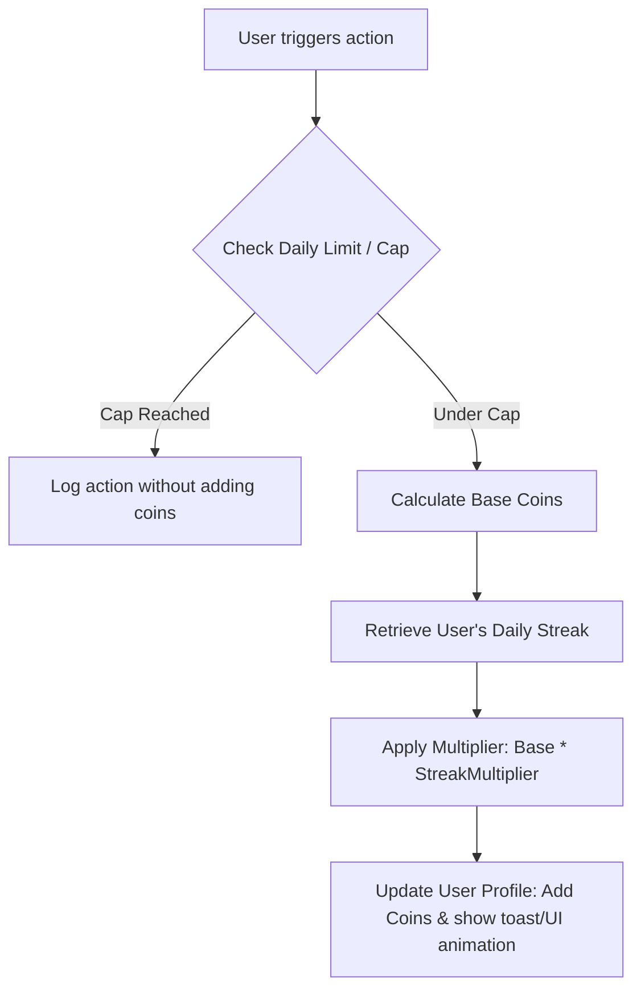

# Coin and Points Based Gamification System Design

This document details the calculation matrix, multipliers, limits, and architectural implementation plans for integrating a gamified coin system into the application.

---

## 1. Core Principles of the Coin Economy
To keep the system engaging and prevent gaming (e.g., logging 50 glasses of water in 5 minutes just to get coins), we categorize actions by **effort** and apply **daily caps**.

### A. Points Matrix by Effort Level
*   **Micro-Actions (Low Effort):** Simple check-ins, tracking water, quick logs.
*   **Medium-Actions (Moderate Effort):** Checking off individual tasks/routines, validating SMS transactions.
*   **Macro-Actions (High Effort):** Writing a full journal/reflection, completing an entire milestone goal.

| Action Category | Action Trigger | Coins Awarded | Daily Limit / Cap | Rationale |
| :--- | :--- | :--- | :--- | :--- |
| **Hydration** | Log Water (250ml) | **+2 coins** | Max 8 times (16 coins) | Quick, repetitive habit reinforcement. |
| | Daily Water Goal Met | **+10 coins** | Max 1 time (10 coins) | Milestone bonus for hitting daily hydration targets. |
| **Journaling** | Write Note / Journal Entry | **+15 coins** | Max 2 entries (30 coins) | Requires high cognitive effort and text input. |
| | Log Quick Mood Check-in | **+3 coins** | Max 3 check-ins (9 coins) | Low friction, checks emotional state. |
| **Transactions** | Add Manual Transaction | **+5 coins** | Max 5 logs (25 coins) | Reward for building financial awareness. |
| | Validate SMS Transaction | **+2 coins** | Max 10 logs (20 coins) | Validation incentive for auto-detected items. |
| **Tasks & Habits** | Complete SubTask (in routine) | **+2 coins** | Max 20 subtasks (40 coins) | Granular reward for step-by-step progress. |
| | Complete Single Activity | **+10 coins** | Scheduled count | A checked habit or single routine checklist. |
| | Achieve Task Goal / Milestone | **+25 coins** | Variable | Large progress achievements. |

---

## 2. Gamification Multipliers & Retention Triggers

### A. Daily Consistency Streak
Keep users returning by applying a streak multiplier to all coins earned on a given day:
*   **1–2 day streak:** $1.0\times$ coins
*   **3–4 day streak:** $1.1\times$ coins
*   **5–6 day streak:** $1.25\times$ coins
*   **7+ day streak:** $1.5\times$ coins

### B. Daily Completion Bonus ("Clear the Board")
*   If a user completes **100% of their scheduled activities** for the day: **+50 bonus coins**.
*   This motivates them to finish remaining tasks when they are close to completing their checklist.

---

## 3. Implementation Blueprint (Code Architecture)

We can encapsulate this in a clean, state-independent service that updates a user's total coins in your Firestore schema when database transactions occur.

### Suggested Class Structure

```dart
class CoinRewards {
  // Water
  static const int waterLog = 2;
  static const int waterDailyGoal = 10;
  
  // Journal/Note
  static const int journalWrite = 15;
  static const int quickMood = 3;

  // Transactions
  static const int manualTransaction = 5;
  static const int validateSmsTransaction = 2;

  // Activities
  static const int completeSubTask = 2;
  static const int completeSingleActivity = 10;
  static const int completeMilestone = 25;

  // Daily Caps
  static const int maxWaterLogs = 8;
  static const int maxJournalEntries = 2;
  static const int maxTransactions = 5;
}
```

### Calculation Flow Chart
When a user completes an action (e.g., adding a Transaction or submitting a NoteEntity):


