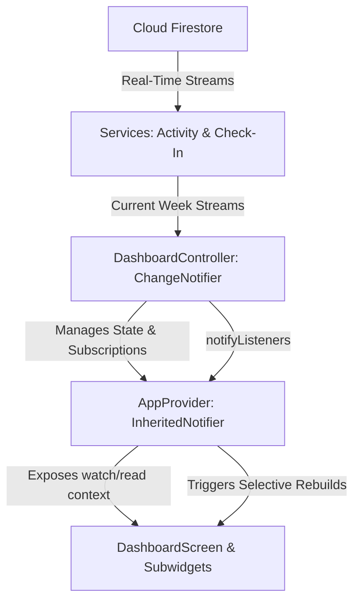

# Custom State Management & Performance Optimization Plan

This document outlines the custom, zero-dependency state management design and performance optimizations implemented for `DashboardScreen` to achieve highly performant rendering, clean separation of concerns, and efficient Firebase data querying.

---

## 1. Core Architecture

The architecture uses Flutter's built-in SDK primitives to create a lightweight, type-safe state container.

### Key Components:
1. **`DashboardController`** (`ChangeNotifier`):
   - Subscribes to Firestore streams on startup.
   - Evaluates, filters, caches, and sorts activities (pending, completed, skipped) and weekly stats in memory.
   - Restricts operations: only recomputes derived data when new stream values are received (never during normal frame rebuilds).
   - Cleans up subscriptions in its `dispose()` method.
2. **`AppProvider<T>`** (`InheritedNotifier<T extends Listenable>`):
   - A generic provider that acts as a wrapper around InheritedWidget.
   - Exposes `AppProvider.watch<T>(context)` to retrieve the notifier and subscribe the calling widget to updates.
   - Exposes `AppProvider.read<T>(context)` to retrieve the notifier without subscribing to rebuilds (useful for one-off callbacks/methods).

---

## 2. Firebase Query Constraints

To avoid downloading the entire global history of check-ins and tasks as the database grows, queries are constrained to the current week:

* **Query cutoff**: Start of current Monday minus 1 day buffer (covers all local timezones).
* **`getCheckInsStreamForCurrentWeek()`** (`CheckInService`): Queries check-ins logged after the cutoff.
* **`getSubTasksStreamForCurrentWeek()`** (`ActivityService`): Queries subtasks logged after the cutoff.

---

## 3. UI Optimization Details

- **Nested Builders Elimination**: Flattened the code by replacing triple nested `StreamBuilder` widgets with a single reactive `AppProvider.watch<DashboardController>(context)`.
- **ValueKeys**: Added unique `ValueKey(activity.id)` to `ActivityChip` widgets inside `Wrap` layouts. This helps Flutter's reconciliation algorithm update the element tree with O(N) efficiency when activity items move between active, skipped, and completed lists.
- **Removed Redundant Rebuilds**: Eliminated the redundant empty `setState(() {})` pop handler on modal sheet closure. Updates to Firestore now flow naturally through stream emissions, triggering the controller and rebuilding the widget tree automatically.
