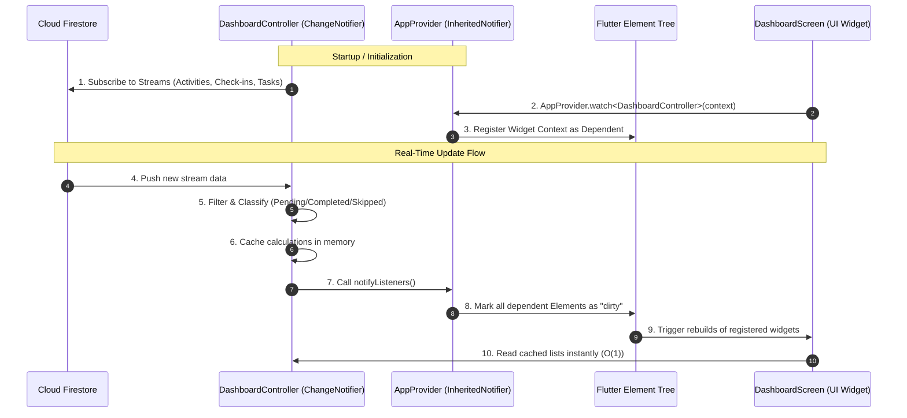
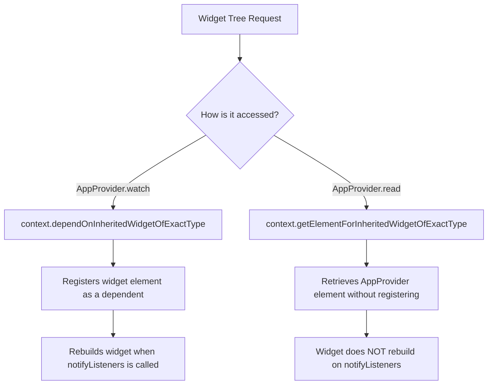

# How Custom State Management Works (Under the Hood)

This document provides a deep technical dive into our zero-dependency state management container (`AppProvider` and `DashboardController`). It explains the architectural design, Flutter framework mechanics, and optimization patterns used to make the app fast and clean.

---

## 1. Architectural Overview

The custom state management system relies on two main pillars of the Flutter SDK:
1. **`ChangeNotifier`** (State & Business Logic Container)
2. **`InheritedNotifier`** (Dependency Injection & Reactive Dispatcher)

Here is how data and events flow through the application:



---

## 2. Component Deep Dive

### A. The Observable Model: `ChangeNotifier`

`DashboardController` extends `ChangeNotifier`. It acts as the single source of truth for the dashboard state.

* **Stream Listening**: Upon creation, it sets up active `StreamSubscription` objects on Firestore queries.
* **On-Demand Computation**: When any Firestore stream emits a new value, the controller runs `_recomputeAndNotify()`. This partitions data into `_pendingActivities`, `_completedActivities`, and `_skippedActivities` once and caches them.
* **`notifyListeners()`**: Inherited from `ChangeNotifier`, this iterates over an internal list of registered `VoidCallback` objects and executes them.

### B. The Reactive Wrapper: `InheritedNotifier<T>`

`AppProvider<T extends Listenable>` extends `InheritedNotifier<T>`. 

```dart
class AppProvider<T extends Listenable> extends InheritedNotifier<T> {
  const AppProvider({
    super.key,
    required T super.notifier,
    required super.child,
  });
  ...
}
```

* `InheritedNotifier` is a specialized subclass of `InheritedWidget` built specifically for listening to objects that implement `Listenable` (like `ChangeNotifier`).
* It acts as a bridge: when the `notifier` calls `notifyListeners()`, the `InheritedNotifier` automatically triggers a rebuild for all widgets that depend on it.

---

## 3. Flutter Internals: How Rebuilds are Triggered

To understand how updates propagate, we look at the difference between two static methods in `AppProvider`:



### 1. The Reactive Path: `AppProvider.watch<T>(context)`
When a widget calls `AppProvider.watch<DashboardController>(context)`:
* Flutter calls `context.dependOnInheritedWidgetOfExactType<AppProvider<T>>()`.
* This traverses up the Element Tree to find the closest `AppProvider` ancestor.
* It registers the caller's `BuildContext` (which is an `Element` in the element tree) in the `InheritedNotifier`'s internal dependency map.
* When `notifyListeners()` is called inside the controller, the `InheritedNotifier` marks all registered dependent elements as **dirty** (`markNeedsBuild()`). Flutter then schedules them to rebuild on the next frame.

### 2. The Direct Path: `AppProvider.read<T>(context)`
When a widget calls `AppProvider.read<DashboardController>(context)`:
* Flutter calls `context.getElementForInheritedWidgetOfExactType<AppProvider<T>>()`.
* This locates the element ancestor in `O(1)` time but **does not** register the context as a dependent.
* Because no dependency link is created, when `notifyListeners()` is called, this widget is **not** rebuilt.
* **Use Case**: This is ideal for trigger buttons or dialog options (e.g., clicking to log an activity) where you need to call a function on the controller but the button layout itself doesn't change visually.

---

## 4. Key Performance Benefits of This Design

By using this custom framework, we achieve three critical performance optimizations:

1. **Elimination of Nested StreamBuilders**:
   * Previously, `DashboardScreen` nested multiple `StreamBuilder` widgets. If any single stream changed, it caused multiple rebuild cycles down the entire subtree.
   * Now, Firestore updates flow into a single unified listener, which computes the clean state and performs a single visual refresh.

2. **In-Memory Caching & Classification**:
   * Instead of sorting, filtering, and checking dates during the UI's `build` phase (which runs repeatedly during animations, scrolls, and hover triggers), all computational tasks are done **exactly once** when Firestore delivers updates. The UI only reads pre-sorted getter lists.

3. **Granular Rebuilds**:
   * Sub-widgets can consume only what they need. For example, a quick action button can use `AppProvider.read` to invoke actions without ever triggering a rebuild of itself.
   * Using `ValueKey(activity.id)` on the activity chips allows Flutter's reconciliation algorithm to swap elements within list containers efficiently (in $O(N)$ operations rather than rebuilding the entire layout).

---

## 5. Lifecycle and Memory Management

To prevent memory leaks:
* The `DashboardController` handles its own cleanup.
* When the controller is removed from the widget tree (which occurs when the dashboard is disposed), its `dispose()` method is automatically triggered.
* It calls `.cancel()` on all three `StreamSubscription` instances (`_activitiesSub`, `_checkInsSub`, `_subTasksSub`), closing the active channels to Cloud Firestore.
