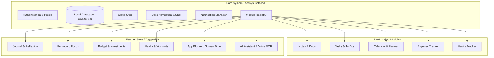
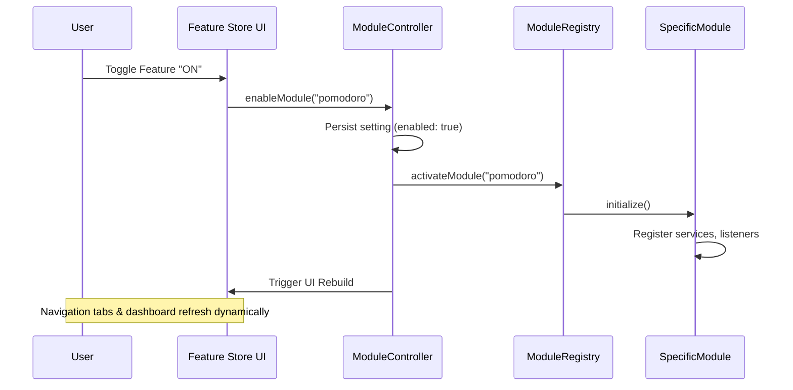
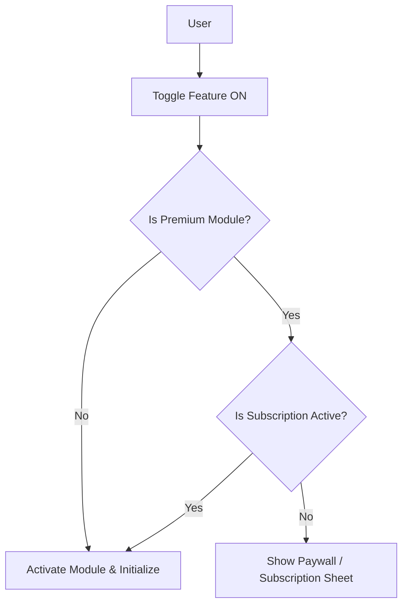

# Life OS Modular Architecture Design

This document details the architectural options, structures, and categorization for building the "Life OS" application using a highly scalable, plugin-based modular approach.

---

## 1. Architectural Options Comparison

| Option | Description | Pros | Cons | Recommendation |
| :--- | :--- | :--- | :--- | :--- |
| **Option 1: Feature Flags** | Ship all code; toggle visibility per user. | Easy to maintain, works on iOS/Android, instant toggles. | App size includes all features. | **Recommended** for initial phases to minimize development complexity. |
| **Option 2: Modular Features** | Features built as independent local packages. | Extremely clean, high reusability, great for scaling. | Requires upfront architecture planning. | **Recommended** long-term design target. |
| **Option 3: Dynamic Delivery** | Download modules on-demand at runtime. | Small initial install size. | Android-only (Play Feature Delivery), iOS unsupported. | Not recommended for cross-platform apps. |
| **Option 4: Backend-Driven** | UI and layout driven by backend JSON configs. | Highly flexible, remote config changes. | Complex state management, offline-first challenges. | Avoid unless heavily server-dependent. |

---

## 2. Recommended Plugin-Based System Structure

A hybrid approach of **Local Modular Packages** with **Feature Flags/Visibility Toggles** is optimal. Each module registers itself with a core registry:



---

## 3. Module Categorization

### Core (Non-removable)
*   **Authentication & Profile Management**
*   **Navigation & Home Dashboard Shell**
*   **Local Database & Cloud Sync**
*   **Notification Engine**
*   **Backup & Restore / Export Tools**

### Default Modules (Pre-installed & Editable)
*   **Notes:** Quick captures, markdown notes.
*   **Tasks & Habits:** Habit stacking, daily agendas, priority lists.
*   **Calendar:** Events, schedule blockings.
*   **Expenses:** Daily transactional logging, quick receipts.

### Optional Modules (Feature Store / On-Demand Activation)
*   **Productivity:** Pomodoro focus, journal, time blocking, bookmark manager.
*   **Finance:** Budget planner, subscription tracker, EMI tracker.
*   **Health:** Workout tracker, sleep logs, hydration counter, water reminder.
*   **Digital Wellbeing:** Screen time tracker, app/website locker, focus mode.
*   **AI Extensions:** Voice logs OCR, automatic transcripts, intelligent search.

---

## 4. Starter Pack Configurations

To avoid choice paralysis during user onboarding, we group optional modules into **Starter Packs**:

*   **🎓 Student Pack:** Notes + Tasks + Pomodoro + Habit Tracker.
*   **💼 Professional Pack:** Tasks + Calendar + Expenses + AI Assistant.
*   **🏋️ Fitness Pack:** Workout + Weight + Hydration + Habits.
*   **💳 Finance Pack:** Expenses + Budget Planner + Subscription Tracker + Bills.

---

## 5. Cross-Platform Management (iOS & Android)

Managing a modular system across both iOS and Android requires addressing specific platform limitations (especially iOS guidelines) and native integrations.

### 5.1 Dart-Only Multi-Package Structure (Monorepo)
For 90% of features (Notes, Tasks, Expenses), modularity is achieved purely in Dart using local packages within a monorepo structure.

```
/lib             # Shell application & UI shell
/packages
  ├── core_database
  ├── core_ui
  ├── notes_module
  ├── expenses_module
  └── digital_wellbeing_module
```
* **Pure Dart/Flutter Code:** Features compile seamlessly to both platforms. We use `pubspec.yaml` path dependencies to link modules locally.
* **Service Locator (GetIt/Registry):** Core defines service contracts (interfaces), and modules implement them. Modules register their presence with the `Registry` at app startup.

### 5.2 Handling Platform-Specific Features (Native Integrations)
Some modules (e.g., App Locker, Screen Time limiters) require OS-level APIs that are fundamentally different between iOS and Android.

* **iOS:** Device Activity API, Family Controls (requires Apple Developer Program entitlements), and DeviceActivityMonitor extension.
* **Android:** DevicePolicyManager, UsageStatsManager, and AccessibilityServices.

#### Solution: Platform Interface Pattern
Create a unified Dart interface in the package, with separate native implementation files:
```dart
abstract class WellbeingPlatformInterface {
  Future<bool> requestPermissions();
  Future<void> blockApps(List<String> packageOrBundleIds);
  Future<List<AppUsageInfo>> getScreenTime();
}
```
* **Graceful Degradation:** If a feature cannot run on a platform (e.g., Apple blocks certain screen-time modification APIs without special enterprise setup), the plugin returns `false` or throws an unsupported exception. The UI then gracefully hides or disables the toggle with a message: *"Not supported on iOS due to Apple's security policy."*

### 5.3 App Store and Play Store Compliance
* **iOS (No Dynamic Loading):** Apple Guideline 2.5.2 prohibits loading executable code dynamically. All optional modules must be compiled directly inside the app bundle. Modularity on iOS is **logical** (hiding/showing features via feature flags) rather than physical (downloading code later).
* **Unified Binary Size Optimization:** Since all code is compiled in, optimize assets (e.g., SVG/Vector graphics, network-loaded images) and compress libraries to keep the final IPA/APK file size minimal.

### 5.4 Modular Database Schema Management
When features are separated, their databases should be too, to prevent tight coupling:
* **Option A (Separate Files):** Each module opens its own database instance (e.g., `notes.db`, `expenses.db`).
* **Option B (Core Migrator):** The core database engine allows modules to register their tables/entities dynamically at startup before the database opens. For example, using Drift or Isar, the core database builder collects list schemas:
  ```dart
  final schemas = ModuleRegistry.instance.getEnabledSchemas();
  final isar = await Isar.open(schemas, directory: dir);
  ```

---

## 6. On-Demand Feature Lifecycle & Management

To implement true "on-demand" logic in a compiled unified binary (Option 1/2), we manage the lifecycle of each module programmatically. This ensures that disabled features consume zero memory, CPU, or background resources.

### 6.1 The [AppModule](file:///c:/Users/hipradeep/Documents/android_apps/log_app/hinotes/life_os_modular_architecture.md#L162) Interface

Every module implements a common contract to handle its lifecycle operations:

```dart
abstract class AppModule {
  String get id;
  String get name;
  String get description;
  
  // Lifecycle hooks
  Future<void> initialize(); // Load dependencies, register services, setup listeners
  Future<void> shutdown();   // Unsubscribe streams, close db, clear cached data
  
  // UI Integrations
  Widget buildDashboardWidget(BuildContext context);
  List<NavigationItem> getNavigationItems(BuildContext context);
}
```

### 6.2 Module Registry Coordinator

A central registry ([ModuleRegistry](file:///c:/Users/hipradeep/Documents/android_apps/log_app/hinotes/life_os_modular_architecture.md#L179)) manages available modules and tracks which ones are active based on user preferences.

```dart
class ModuleRegistry {
  ModuleRegistry._();
  static final ModuleRegistry instance = ModuleRegistry._();

  final Map<String, AppModule> _availableModules = {};
  final Map<String, AppModule> _activeModules = {};

  void registerModule(AppModule module) {
    _availableModules[module.id] = module;
  }

  Future<void> activateModule(String id) async {
    final module = _availableModules[id];
    if (module != null && !_activeModules.containsKey(id)) {
      await module.initialize();
      _activeModules[id] = module;
    }
  }

  Future<void> deactivateModule(String id) async {
    final module = _activeModules.remove(id);
    if (module != null) {
      await module.shutdown();
    }
  }
}
```

### 6.3 Lifecycle Triggers



### 6.4 Dynamic UI Assembly
* **Dynamic Dashboard:** The dashboard queries `ModuleRegistry.instance.getActiveModules()` and builds a list of cards by calling `buildDashboardWidget` on each active module.
* **Dynamic Navigation:** The navigation bar determines tabs/menu options based on the list of active modules. If a feature is disabled, its navigation path is unregistered or inaccessible.
* **Feature Store Screen:** A dedicated UI panel where users can review all registered `_availableModules` and toggle their activation state. Toggle state changes are dispatched via `ModuleController` which saves state to local preferences.

---

## 7. Subscription-Based Feature Management

For subscription-based (premium) features, a combination of **Option 2 (Modular Packages)** and **Option 1 (Logical Feature Flags)** is the industry standard and most robust approach.

### 7.1 Architectural Mechanics

All features (free and premium) are compiled into the application bundle, but premium features are protected by a subscription validation layer.



### 7.2 Code Level Integration

We extend [AppModule](file:///c:/Users/hipradeep/Documents/android_apps/log_app/hinotes/life_os_modular_architecture.md#L162) to include access tiers, and use a [SubscriptionService](file:///c:/Users/hipradeep/Documents/android_apps/log_app/hinotes/life_os_modular_architecture.md#L253) to verify credentials.

```dart
abstract class AppModule {
  String get id;
  String get name;
  String get description;
  bool get isPremium; // Access Tier check
  
  Future<void> initialize();
  Future<void> shutdown();
  
  Widget buildDashboardWidget(BuildContext context);
  List<NavigationItem> getNavigationItems(BuildContext context);
}
```

```dart
class SubscriptionService {
  SubscriptionService._();
  static final SubscriptionService instance = SubscriptionService._();

  bool _isSubscribed = false;
  bool get isSubscribed => _isSubscribed;

  // Integrates with local receipt validation or services like RevenueCat
  Future<void> checkSubscriptionStatus() async {
    // 1. Fetch cached status from encrypted local storage
    // 2. Perform background check with RevenueCat/Apple/Google
    _isSubscribed = await _fetchStatusFromStore();
  }
}
```

### 7.3 Recommended Stack & Best Practices

1. **Integration Service (RevenueCat):** Use RevenueCat (or similar IAP wrapper) for managing subscriptions across iOS and Android. It abstract away Apple App Store receipt validation, Google Play Billing APIs, and offline grace periods.
2. **Offline-First Grace Periods:** Save the subscription token inside secure hardware storage (e.g. `flutter_secure_storage`). Verify subscriptions locally first to keep the app working offline, and sync with stores on internet reconnects.
3. **Smart Paywall Interceptors (Upselling):**
   * **In the Feature Store:** Premium modules are marked with a lock badge (🔒). Toggling them opens the Paywall Sheet instead of initializing the module.
   * **On the Dashboard:** We can optionally display a collapsed or grayed-out preview of premium modules (e.g., *"Unlock Smart AI Reports 📈"*). Clicking it opens the paywall.
4. **Dynamic Route Protection:** If a user cancels their subscription, the background sync triggers a downgrade. The app calls `deactivateModule(id)` on all premium modules, removing their features from the navigation shell immediately.

### 7.4 Cross-Platform Support Verification (iOS & Android)

This subscription management flow is fully supported by both iOS and Android:

| Feature Layer | iOS Integration | Android Integration | Cross-Platform Library |
| :--- | :--- | :--- | :--- |
| **In-App Billing** | StoreKit API | Google Play Billing API | `purchases_flutter` (RevenueCat) |
| **Secure Token Storage** | iOS Keychain Services | Android Keystore / Encrypted Shared Prefs | `flutter_secure_storage` |
| **Logical Modularity** | Compiled inside IPA (logical toggle) | Compiled inside APK (logical toggle) | Standard Flutter / Dart Packages |
| **App Store Review** | Fully compliant with App Store Guidelines (Sec. 2.5.2) | Fully compliant with Play Store Guidelines | N/A |

---

## 8. Codebase Management & Monorepo Structure

To manage the code for both platforms cleanly without duplicating code or manually syncing native projects, we use a **Single-Repo Multi-Package Monorepo** structure.

### 8.1 Repository Layout

All platform-specific code and shared Dart code live in one repository:

```
life_os/
  ├── android/                  # Android Runner (Generated automatically)
  ├── ios/                      # iOS Runner (Generated automatically)
  ├── lib/                      # Main Shell App (Navigation, App initialization, Themes)
  ├── pubspec.yaml              # Root project configurations
  │
  └── packages/                 # Feature Packages & Plugins
        ├── core_database/      # DB schemas, migrations, entities
        ├── core_ui/            # Shared widgets, themes, and design tokens
        │
        ├── notes_module/       # Pure Dart package (UI, Controllers, Models)
        │
        └── digital_wellbeing/  # Platform Plugin (Contains platform-specific folders)
              ├── android/      # Native Kotlin code (DevicePolicyManager, etc.)
              ├── ios/          # Native Swift code (DeviceActivity, Swift UI extensions)
              ├── lib/          # Dart API interface bridging native to Flutter
              └── pubspec.yaml
```

### 8.2 How Flutter Manages Platform Compilation

Flutter completely automates the native linking of modular packages, ensuring we don't have to touch Xcode or Gradle configurations manually:

*   **Android Linking (Gradle):**
    When the shell app builds, the Flutter toolchain reads the active dependencies in `pubspec.yaml`. It automatically generates `.flutter-plugins-dependencies` and injects the Kotlin/Java code of `/packages/digital_wellbeing/android` into the main Gradle build. It is compiled directly as a sub-project of the main Android app.
*   **iOS Linking (CocoaPods):**
    During `flutter build ios`, CocoaPods scans the local package paths. It registers a local Pod for `/packages/digital_wellbeing/ios` using a generated podspec. CocoaPods compiles and links these Swift files directly into the Xcode runner target at build time.

### 8.3 Linking Local Packages

In the root `pubspec.yaml`, local modules are linked using local relative paths:

```yaml
name: life_os
description: The main Life OS shell application

dependencies:
  flutter:
    sdk: flutter
  
  # Core Shared Packages
  core_database:
    path: ./packages/core_database
  core_ui:
    path: ./packages/core_ui

  # Feature Packages
  notes_module:
    path: ./packages/notes_module
  digital_wellbeing:
    path: ./packages/digital_wellbeing
```

### 8.4 Developer Tooling: Melos

Managing a multi-package repository manually can be cumbersome (e.g. running `flutter pub get` in 10 different package folders). 

To solve this, we use [Melos](https://pub.dev/packages/melos), a monorepo management tool for Dart/Flutter:
*   **Melos Bootstrap:** Run `melos bootstrap` to instantly run `pub get` across all packages and configure local path overrides so packages can reference each other.
*   **Melos Clean:** Deletes build artifacts and lockfiles in all sub-packages.
*   **Melos Run:** Runs commands across selected packages (e.g., `melos exec -- flutter test` runs unit tests in all packages in parallel).

---

## 9. Single App Bundle Constraints vs Dynamic Delivery

It is critical to distinguish between **Code** (compiled binary executable) and **Assets** (images, animations, static config files) when discussing dynamic on-demand delivery.

### 9.1 The iOS Hard Rule (Single App Bundle)
Yes, **for iOS, you have only one option: you must compile all code into the single app bundle.**
*   **Apple Guideline 2.5.2 (Executable Code):** Apple strictly forbids running downloaded executable code (like extra `.dylib` or dynamic Swift binaries) at runtime. Any attempt to dynamically load compiled code from a server will result in an immediate rejection or ban from the App Store.
*   **Impact:** Even if a user never uses the "Habit Tracker" or the "AI Module," their code binary *must* exist within the `.ipa` installed on their iPhone.

### 9.2 The Android Exception (Play Feature Delivery)
Android supports **Play Feature Delivery** (via App Bundles `.aab`), which does allow downloading feature modules containing both Java/Kotlin compiled code and assets at runtime.
*   **How it works:** The user downloads a base app (e.g., 10MB). When they click "Enable Workout module," the Android system requests Google Play to fetch and dynamically merge the dynamic module `.apk`.
*   **Why this is rarely used in Flutter:**
    1.  **Platform Asymmetry:** You would need to write two separate loading systems (on iOS, show the local feature instantly; on Android, show a loading spinner and fetch from Google Play).
    2.  **Flutter Support Limitations:** Flutter's deferred loading (`deferred as`) exists but is notoriously complex to build, test, and keep synchronized across SDK updates.
    3.  **Increased Build Complexity:** Requires maintaining multiple Gradle dynamic-feature configuration setups.

### 9.3 The Industry Standard Solution: "Hybrid" Dynamic Delivery
To keep the app bundle size small while complying with iOS guidelines, developers separate **Code** from **Heavy Assets**:

```
[ App Installed from Store ]
 ├── Compiled Executable Code (All features - Free & Premium) -> Very Lightweight (~5-8 MB)
 └── Core UI Layouts & Core Icons
      
[ Downloaded on Demand (CDN/Server) ]
 ├── Heavy Graphics, Rive/Lottie Animations
 ├── Help Videos & Sound Packs
 └── ML models (e.g., TensorFlow Lite models for AI features)
```

1.  **Code is Monolithic:** Compile all feature logic (Dart/Swift/Kotlin) into the single binary. Because Dart AOT compilation uses **Tree Shaking** and generates highly compressed machine code, 12 full features might only add 3–5MB of total compiled code size.
2.  **Assets are On-Demand:** Keep heavy media, graphics, fonts, or AI models out of the installation package. Host them on a Content Delivery Network (CDN) (like AWS S3 or Firebase Storage). When the user activates a feature, download these assets and cache them locally:
    ```dart
    // Example: Dynamically downloading Lottie asset only when user unlocks the feature
    LottieBuilder.network('https://cdn.my-life-os.com/assets/pomodoro_lottie.json');
    ```


