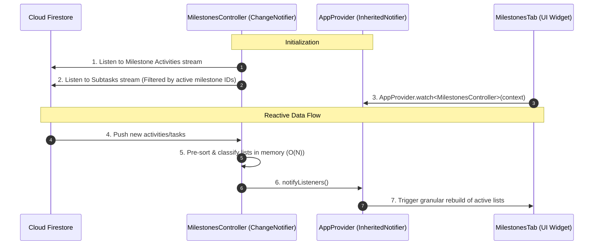

# Milestones Tab Performance Optimization Analysis

This document provides a technical analysis of performance, queries, and layout structures focused exclusively on the **Milestones Tab** of the Management Screen.

---

## 1. Identified Performance & Architectural Issues

### 🔴 High Priority

#### A. Unbounded Firestore Subtask Queries
* **Code Location**: `management_screen.dart` L658 -> `_activityService.getSubTasksStream()`
* **Problem**: The stream query fetches the **entire** global `subtasks` collection from Cloud Firestore without any date range constraint, pagination, or milestone scoping.
* **Impact**: As the user continues to add subtasks, the document read count and network payload downloaded on every change will grow infinitely. This slows down the rendering of the milestones list and significantly increases database read fees.

#### B. Double Nested StreamBuilders
* **Code Location**: `management_screen.dart` L624-660 -> `_buildMilestonesContent()`
* **Problem**: The UI nests a subtasks stream listener directly inside an activities stream listener:
  ```
  StreamBuilder<List<Activity>> (Listen for Milestone Activities)
    └─ StreamBuilder<List<Task>> (Listen for Subtasks)
        └─ MilestonesTab (Render UI Lists)
  ```
* **Impact**: Any change in either of the streams triggers a cascade rebuild of the entire Milestones widget tree, executing redundant classification and date check loops.

---

### 🟡 Medium Priority

#### A. Loop-Level DateTime Allocations
* **Code Location**: `milestones_tab.dart` L487 -> `_isToday()`
* **Problem**: The helper method `_isToday` instantiates `DateTime.now()` on every call. It is executed inside loop filters checking every task:
  ```dart
  for (var st in filteredSubTasks) {
    if (_isToday(st.timestamp)) { ... }
  }
  ```
* **Impact**: Triggers heavy garbage collection (GC) load in memory during list updates or active scroll rebuilds.

#### B. Missing Widget Keys on Task Lists
* **Code Location**: `milestones_tab.dart` list builders
* **Problem**: Subtask list item widgets (`TaskCard`) do not define keys.
* **Impact**: When task states transition (e.g. checked, unchecked, or rescheduled), Flutter cannot matches old layout nodes to new ones efficiently, forcing full widget rebuilds.

---

## 2. Proposed Architectural Optimizations

We can restructure the Milestones tab using a dedicated state controller to keep the UI layer clean and lightweight:



### Proposed Action Steps:
1. **Filter subtasks stream**: Introduce a query method that retrieves subtasks associated only with checked/active milestone IDs.
2. **Implement `MilestonesController`**: Subscribes to the filtered streams and handles lists sorting and classification.
3. **Cache build-scoped dates**: Instantiate `today` once at the top of the `build()` method in `MilestonesTab` and compare dates using `isSameDay(st.timestamp, today)`.
4. **Keys**: Assign `key: ValueKey(st.id)` inside task builders to optimize element diffing.
