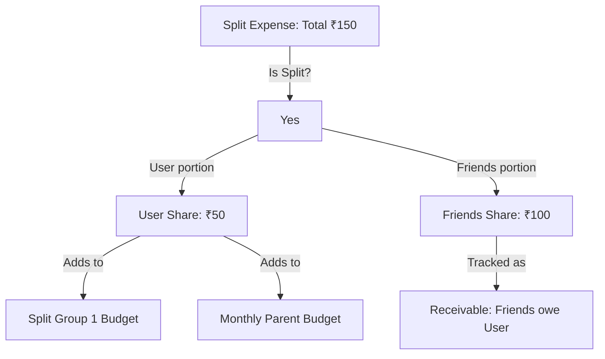

# Plan: Group Split Expense Management with Budget Hierarchy

This document outlines the architecture, database schema, calculations, and UI design for integrating group expense splitting and parent-child budget hierarchies.

---

## 1. Architectural Comparison: Unified Budget vs. Dedicated Entity

When designing the **"Split Group 1"** structure, we can model it as a sub-type of the existing **`Budget`** entity, or create a completely separate **`SplitGroup`** collection.

| Dimension | Option A: Unified `Budget` Entity (Recommended) | Option B: Dedicated `SplitGroup` Entity |
| :--- | :--- | :--- |
| **Firestore Path** | `/budgets/{budgetId}` | `/split_groups/{groupId}` |
| **Logic Reuse** | Reuses existing limits, periods (daily/weekly/monthly), active states, and date range calculation logic. | Requires re-implementing limits, period resets, and active states from scratch. |
| **Queries & Performance** | Single stream subscription fetches all budgets. Reduces rebuilds and network reads. | Multiple streams (budgets + split_groups) must be synced, increasing controller complexity. |
| **State Management** | Handled natively inside the existing `BudgetController`. | Requires a new `SplitGroupController` and separate cache service logic. |
| **Schema Cleanliness** | Pollutes standard budgets with `parentBudgetId` and `categoryType` fields. | Keeps standard budgets pure and isolated. |

### Recommendation: Option A (Unified `Budget` Entity)
Reusing the `Budget` entity is the most performant and elegant approach because:
1. **Budget-like behavior is expected**: A Split Group represents a spending pool with a limit (e.g. ₹5,000) over a period (Monthly/Custom), which maps perfectly to the existing `Budget` features.
2. **Double inclusion is simpler**: When calculating the parent "Monthly" budget spent, it simply filters transactions belonging to `parentId` or its `childBudgetIds`.

---

## 2. Core Architecture & Hierarchy Flow



### Key Principles:
1. **User Share Consumption**: Only the user's specific split portion (`userShare`) counts towards their budget spent amount.
2. **Double-Inclusion Hierarchy**: When a transaction is logged under a split budget (e.g. **"Split Group 1"**), the user's portion is debited from:
   * The child budget **"Split Group 1"**.
   * The parent budget **"Monthly"** (since Split Group 1 specifies "Monthly" as its parent).
3. **Settlements**: Money transferred to settle balances is logged with a special category tag (`tag: "settlement"`) and is ignored by category budgets to avoid duplicating spending metrics.

---

## 3. Firestore Schema Upgrades (Option A)

### A. Budgets Collection (`/budgets/{id}`)
Extend the standard budget document to support hierarchies:
```json
{
  "name": "Split Group 1",
  "limit": 5000.0,
  "period": "monthly",
  "categoryName": "Split",
  "categoryType": "Split",
  "parentBudgetId": "monthly_parent_budget_id",
  "isActive": true
}
```

### B. Transactions Collection (`/transactions/{id}`)
Store split distribution details directly inside the transaction document to avoid costly secondary joins:
```json
{
  "budgetId": "split_group_1_id",
  "tag": "Food",
  "description": "Group Dinner",
  "amount": 150.0,
  "expenseDate": "2026-06-20T00:00:00Z",
  "isSplit": true,
  "paidById": "me",
  "userShare": 50.0,
  "splits": [
    {
      "participantName": "Alice",
      "shareAmount": 50.0,
      "isSettled": false
    },
    {
      "participantName": "Bob",
      "shareAmount": 50.0,
      "isSettled": false
    }
  ]
}
```

---

## 4. Spending & Debt Calculations

### A. Budget spentForCurrentPeriod
When checking a budget's spent amount, check if the budget has children (e.g., "Split Group 1" child of "Monthly"). Include both parent and child transactions, calculating only the `userShare` for split items:
```dart
double calculateBudgetSpent(Budget budget, List<Transaction> allTransactions, List<String> childBudgetIds) {
  double sum = 0.0;
  final targets = [budget.id, ...childBudgetIds];
  
  final budgetTransactions = allTransactions.where((t) => targets.contains(t.budgetId));
  
  for (final tx in budgetTransactions) {
    final double amount = tx.isSplit ? (tx.userShare ?? tx.amount) : tx.amount;
    // ... Date filter logic ...
    sum += amount;
  }
  return sum;
}
```

### B. Dynamic Balance Tracking
Outstanding balances between the user and group members are aggregated dynamically from the active transactions stream:
* **Receivable**: Transactions where `paidById == 'me'` and friend's share `isSettled == false`.
* **Liability**: Transactions where `paidById == friend` and user's share is unpaid.

---

## 5. Screen Layout: SplitManagementScreen

To manage split budgets, a dedicated screen (`SplitManagementScreen`) will display group summaries, list expenses, and settle balances.

### A. Visual Sections
1. **Net Balances Card**: A glassmorphic header block showing:
   * **Total Spent**: Total group cash output.
   * **You Owe**: Liabilities (styled in soft HSL red).
   * **You Are Owed**: Receivables (styled in soft HSL green).
2. **Segmented Control**: Slide-based tab bar between **Expenses** and **Balances**.
3. **Tab 1: Expenses List**: Displays group transactions. Cards show the total amount, payer, and the user's portion.
4. **Tab 2: Balances & Debt**: Lists group members, their net balance standing, and a prominent **"Settle Up"** action button.

### B. Settle Up Action Modal
When the user taps "Settle Up" next to a member:
* A slider sheet appears to record a payment (repayment).
* Submitting writes a transaction with `tag: "settlement"`.
* The related split records are marked as `isSettled: true`.

---

## 6. UI Customization & Adding Budgets

### A. AddBudgetScreen Changes
* Type selector: **Standard** vs **Split** budget.
* Setting type to **Split** automatically:
  * Restricts category type to `"Split"`.
  * Displays a **Parent Budget** dropdown listing active Standard budgets (like `"Monthly"`).
  * Prefills the budget name as `"Split Group 1"`.

### B. UI Spacing & Performance (Audit Compliance)
* **Rule 23 (Stateless Widget Extraction)**: Custom list cards and tab headers will be extracted as separate `const StatelessWidget` subclasses to prevent global sheet updates from triggering rebuilds.
* **Rule 5 (List Gravity)**: Lists will be built using `ListView.builder` with `padding: EdgeInsets.zero` to eliminate nested list scroll issues.
* **Theming**: Fully dynamic using HSL values based on `AppTheme.primaryColor` to preserve a premium glassmorphic feel.
